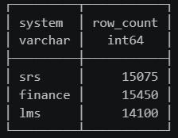
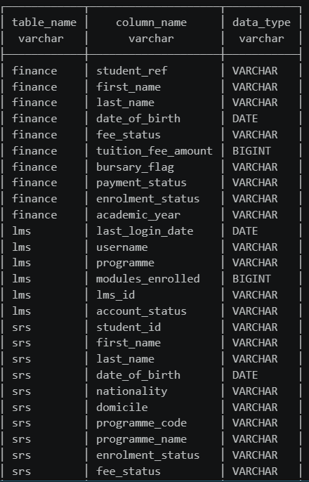
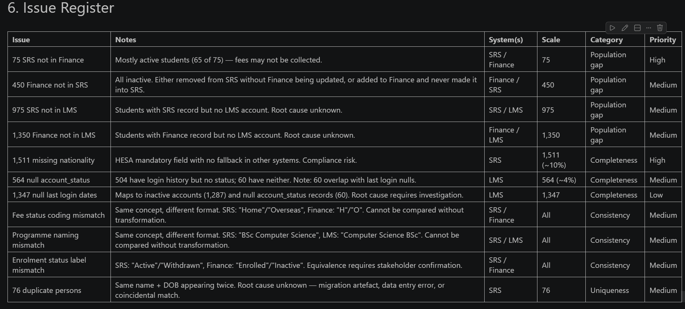
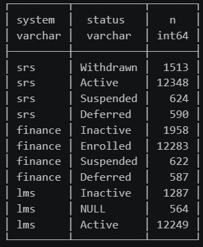
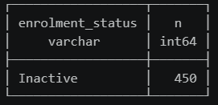
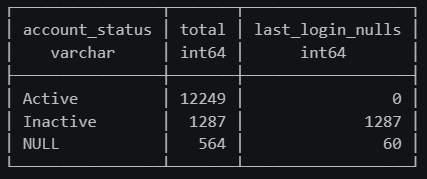

# Multi-System Data Quality Audit

An end-to-end data quality audit across three interconnected systems, from SQL profiling and issue identification through to a structured presentation of findings and recommendations. The scenario simulates a pre-migration audit in a higher education context, with regulatory compliance (HESA returns) as the underlying business driver.

---

## Scenario

A university holds student records across three separate systems that have grown misaligned over time. Before a major system transformation can proceed, the data quality issues must be identified, categorised, and prioritised.

| System | Contents |
|---|---|
| Student Record System (SRS) | Master record: ID, name, DOB, programme, enrolment status, nationality |
| Finance System | Fee status, tuition liability, bursary flags |
| Learning Management System (LMS) | Module enrolments, login and engagement data |

The data is synthetic and was generated to replicate realistic data quality issues. Each system uses its own identifier format (SRS00001, FIN00001, s00001), with no shared key across systems. This inconsistency is itself a data quality issue.

---

## Tech Stack

- **DuckDB:** in-process SQL analytical database
- **Python:** data generation and notebook environment
- **Jupyter Notebook:** analysis workbook
- **SQL:** profiling, validation, cross-system joins

---

## Data Quality Issues Identified

| ID | System | Issue | Scale | Category | Priority |
|---|---|---|---|---|---|
| DQ-1 | SRS | Missing nationality | 1,511 (~10%) | Completeness, HESA compliance risk | High |
| DQ-2 | SRS | Duplicate persons | 76 records | Uniqueness, migration artefact | Medium |
| DQ-3 | SRS / Finance | 75 SRS records not in Finance | 65 active | Population gap, fees may not be collected | High |
| DQ-4 | Finance / SRS | 450 Finance records not in SRS | All inactive | Population gap, likely ghost records | Medium |
| DQ-5 | SRS / LMS | 975 SRS records not in LMS | Mixed statuses | Population gap, no LMS account | Medium |
| DQ-6 | Finance / LMS | 1,350 Finance records not in LMS | — | Population gap | Medium |
| DQ-7 | SRS / Finance | Fee status coding mismatch | All records | Consistency, cannot compare without mapping | Medium |
| DQ-8 | SRS / LMS | Programme naming mismatch | All records | Consistency, cannot join without transformation | Medium |
| DQ-9 | SRS / Finance | Enrolment status label mismatch | All records | Consistency, equivalence unconfirmed | Medium |
| DQ-10 | LMS | Null account_status | 564 (~4%) | Completeness, incomplete migration | Medium |
| DQ-11 | LMS | Null last login dates | 1,347 | Completeness, maps to inactive accounts | Low |

---

## Project Structure

```
multi-system-data-quality-audit/
├── data/
│   ├── srs.csv                  # Student Record System
│   ├── finance.csv              # Finance System
│   ├── lms.csv                  # Learning Management System
│   └── generate_data.py         # Synthetic data generator
├── notebooks/
│   └── student_dq_analysis.ipynb  # Main analysis workbook
├── screenshots/                 # Query outputs and visualisations
├── Student Data Quality Analysis.pptx  # Presentation
└── README.md
```

---

## Analysis Overview

The notebook covers:

1. **Data landscape:** row counts and field inventory across all three systems
2. **Null rate profiling:** completeness check per field per system
3. **Duplicate checks:** duplicate IDs and duplicate persons
4. **Value distribution analysis:** enrolment status, fee status, programme, nationality, login activity
5. **Cross-system analysis:** ID linkage, population overlaps, fee-status and naming conflicts
6. **Issue register:** structured summary of all findings with severity, category, and priority

---

## Key Findings

**Population gaps (cross-system):**
- 65 active students in SRS have no Finance record. Fees may not be collected for current students. Highest priority finding.
- 450 Finance records have no SRS match. All are inactive, likely ghost records from a failed purge process.
- 975 students in SRS have no LMS account. Root cause unknown, requires investigation.
- 1,350 Finance records have no LMS match.

**Completeness:**
- 1,511 null nationality values in SRS (~10%). Nationality is a mandatory HESA return field with no fallback in other systems. Direct compliance risk.
- 564 null account_status values in LMS. 504 of these have login history, suggesting an incomplete migration.
- 1,347 null last login dates in LMS. Maps exactly to inactive accounts (1,287) and null-status records (60). Nulls are not random.

**Consistency:**
- Fee status coded differently across SRS (Home/Overseas) and Finance (H/O). Cannot be compared without transformation.
- Programme names formatted differently across SRS (BSc Computer Science) and LMS (Computer Science BSc). Cannot be joined without transformation.
- Enrolment status uses different labels across SRS (Active/Withdrawn) and Finance (Enrolled/Inactive). Equivalence requires stakeholder confirmation.

---

## Screenshots

Selected query outputs from the analysis:

| | |
|---|---|
|  |  |
|  |  |
|  |  |

---

## How to Run

1. Clone the repo
2. Install dependencies: `pip install duckdb jupyter`
3. Open `notebooks/student_dq_analysis.ipynb` and run cells in order

The CSVs in `data/` are loaded directly into DuckDB at runtime. No database setup required.
